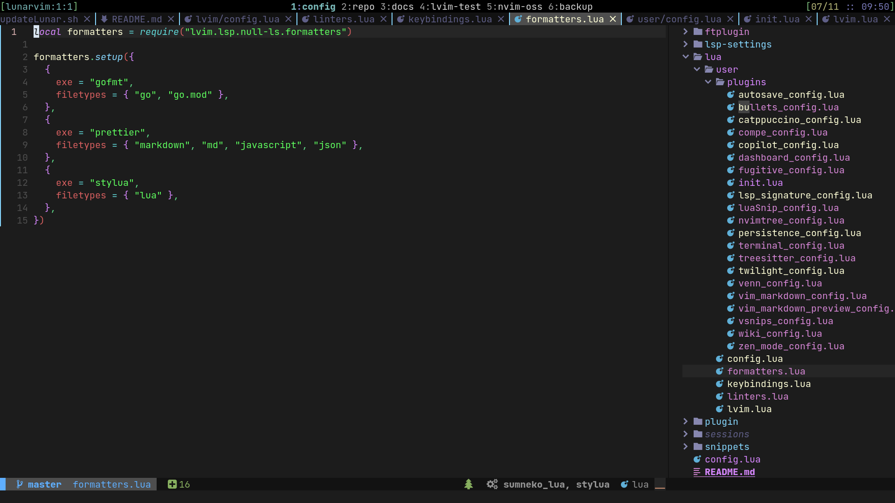

# Lunarvim config

> My [Lunarvim](https://www.lunarvim.org/) config files

 

## Install

> `git clone git@github.com:daniel-vera-g/lvim.git ~/.config/lvim/`

I use the nightly Neovim built. Running `./updateLunar.sh` installs the latest Neovim as Appimage, updates Lunarvim and installs/updates Plugins. As always, check the script for yourself before running ✌

## Structure

> The aim is to provide a modular structure to configure different options, plugins, languages,...

- The config is built around modules which are instantiated in the `./config.lua` entry file
- In sub modules like `plugins`, an `init.lua` file is used. This file allows the option to export all module configuration in one export. In the `config.lua` we then can import the whole module and instantiate it.

### Modules

General:

1. `./lua/user/config.lua`: General vim config
2. `./lua/user/lvim.lua`: Lunarvim built in config
3. `./lua/user/keybindings.lua`: Custom keybindings

Language/File type related:

1. `./lua/user/formatters.lua`: Language formatters
2. `./lua/user/linters.lua`: Language linters
3. `./lsp-settings/`: Home for the language server settings
4. `./ftplugin/`: Language(Aka. File type) specific configuration

Plugin related:

1. `./lua/user/plugins/init.lua`: Plugin specific configuration
2. `./snippets/`: Custom snippets in VSCode Format
3. `./spell/`: Own spell dictionaries

## References

Lunarvim:

1. Docs: https://www.lunarvim.org/
2. Repo: https://github.com/LunarVim/LunarVim

Learn Lua:

1. https://learnxinyminutes.com/docs/lua/
2. https://www.lua.org/pil/
3. https://github.com/nanotee/nvim-lua-guide
